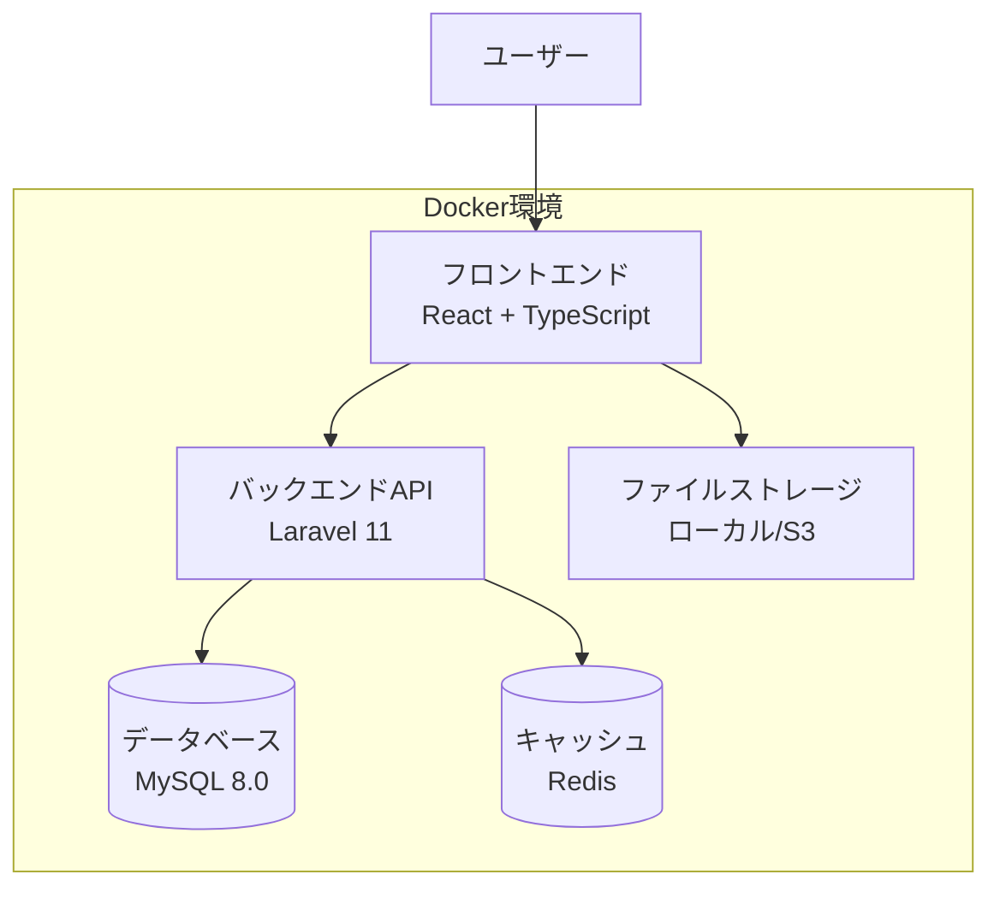
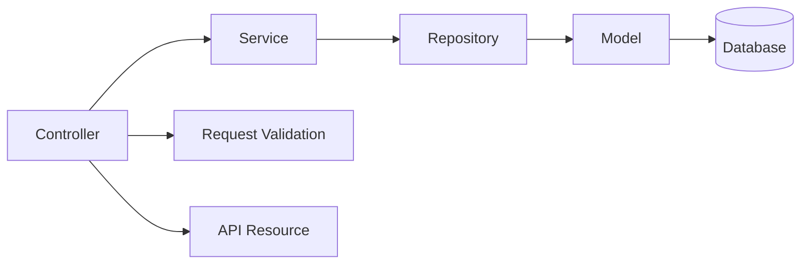
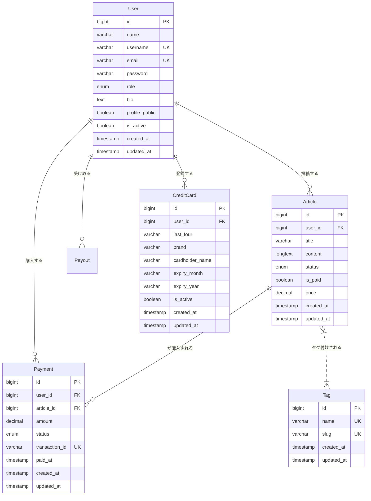
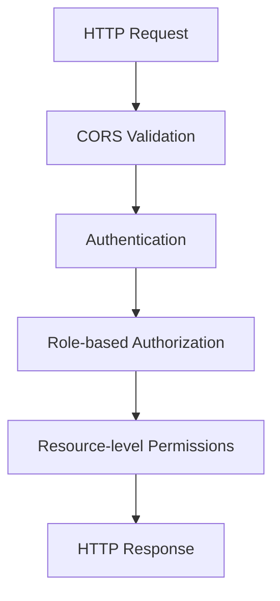
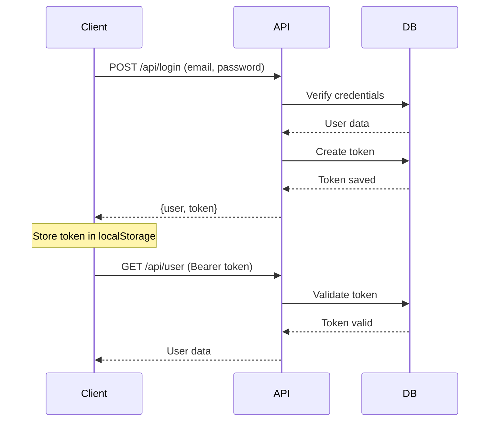

# 技術設計書

## 📋 目次

- [システム構成](#システム構成)
- [アーキテクチャ](#アーキテクチャ)
- [データベース設計](#データベース設計)
- [API設計](#api設計)
- [フロントエンド設計](#フロントエンド設計)
- [セキュリティ設計](#セキュリティ設計)
- [パフォーマンス設計](#パフォーマンス設計)

## 🏗️ システム構成

### 全体構成図


### 技術スタック

| レイヤー | 技術 | バージョン | 用途 |
|----------|------|------------|------|
| **フロントエンド** | React | 19.x | UIフレームワーク |
| | TypeScript | 5.x | 型安全な開発 |
| | TailwindCSS | v4 | スタイリング |
| | Vite | 6.x | ビルドツール |
| **バックエンド** | PHP | 8.3.x | サーバーサイド言語 |
| | Laravel | 11.x | Webフレームワーク |
| | Laravel Sanctum | - | API認証 |
| **データベース** | MySQL | 8.0.x | メインデータベース |
| | Redis | 7.x | キャッシュ・セッション |
| **インフラ** | Docker | - | コンテナ化 |
| | Docker Compose | - | 開発環境 |
| | Nginx | - | Webサーバー |

## 🏛️ アーキテクチャ

### レイヤー構成

#### フロントエンド (React)
```
frontend/src/
├── components/              # 再利用可能コンポーネント
│   ├── ui/                 # 基本UIコンポーネント（Atomic Design）
│   │   ├── Button.tsx      # ボタン（atoms）
│   │   ├── Card.tsx        # カード（atoms）
│   │   ├── Input.tsx       # 入力フィールド（atoms）
│   │   └── Pagination.tsx  # ページネーション（molecules）
│   ├── Layout.tsx          # メインレイアウト（templates）
│   ├── AdminLayout.tsx     # 管理者レイアウト（templates）
│   ├── MarkdownEditor.tsx  # Markdownエディタ（organisms）
│   ├── ActivityHeatmap.tsx # アクティビティヒートマップ（organisms）
│   ├── ArticleCard.tsx     # 記事カード（molecules）
│   └── UserProfileView.tsx # プロフィール表示（organisms）
├── pages/                  # ページコンポーネント（pages）
│   ├── HomePage.tsx        # ホームページ
│   ├── ArticleListPage.tsx # 記事一覧
│   ├── ArticleDetailPage.tsx # 記事詳細
│   ├── UserMyPage.tsx      # マイページ
│   └── Admin*/             # 管理者画面群
├── contexts/               # React Context（状態管理）
│   ├── AuthContext.tsx     # 認証状態管理
│   └── ThemeContext.tsx    # テーマ管理
├── hooks/                  # カスタムフック
│   └── useAutoSave.ts      # 自動保存フック
├── utils/                  # ユーティリティ・API通信
│   ├── api.ts              # API基本設定
│   ├── articleApi.ts       # 記事API
│   ├── userApi.ts          # ユーザーAPI
│   ├── currency.ts         # 通貨フォーマット
│   └── datetime.ts         # 日時処理
├── types/                  # TypeScript型定義
│   ├── article.ts          # 記事関連型
│   ├── auth.ts             # 認証関連型
│   └── tag.ts              # タグ関連型
├── constants/              # 定数定義
│   ├── badgeStyles.ts      # UIスタイル定数
│   └── languages.ts        # プログラミング言語定義
└── styles/                 # スタイルファイル
    └── markdown.css        # Markdownスタイル
```

#### バックエンド (Laravel)
```
backend/app/
├── Http/
│   ├── Controllers/        # MVCコントローラー
│   │   ├── API/           # API専用コントローラー
│   │   │   ├── AuthController.php      # 認証API
│   │   │   ├── ArticleController.php   # 記事API
│   │   │   ├── UserController.php      # ユーザーAPI
│   │   │   ├── AdminController.php     # 管理者API
│   │   │   └── TagController.php       # タグAPI
│   │   └── Controller.php  # ベースコントローラー
│   ├── Middleware/         # ミドルウェア
│   │   └── AdminMiddleware.php # 管理者権限チェック
│   └── Resources/          # APIレスポンス整形
│       ├── PayoutResource.php  # 振込データ
│       └── SaleResource.php    # 売上データ
├── Models/                 # Eloquentモデル（ドメインモデル）
│   ├── User.php            # ユーザーモデル
│   ├── Article.php         # 記事モデル
│   ├── Tag.php             # タグモデル
│   ├── Payment.php         # 決済モデル
│   └── Payout.php          # 振込モデル
├── Services/               # ビジネスロジック（サービス層）
│   ├── AvatarService.php   # アバター生成サービス
│   └── CommissionService.php # 手数料計算サービス
├── Console/Commands/       # Artisanコマンド
│   ├── RegeneratePayout.php        # 振込データ再生成
│   └── GenerateDefaultAvatars.php  # アバター生成
└── Helpers/                # ヘルパークラス
    └── TimeZoneHelper.php  # タイムゾーン処理

backend/database/
├── migrations/             # データベースマイグレーション
│   ├── 2025_07_22_000000_create_all_tables.php
│   └── ...                 # 各種テーブル作成・変更
├── seeders/                # テストデータ生成
│   ├── DatabaseSeeder.php  # メインシーダー
│   ├── UserSeeder.php      # ユーザーデータ
│   └── ArticleSeeder.php   # 記事データ
└── factories/              # ファクトリー（テスト用）
    ├── UserFactory.php     # ユーザーファクトリー
    └── ArticleFactory.php  # 記事ファクトリー

backend/routes/
├── api.php                 # API ルート定義
├── web.php                 # Web ルート定義
└── console.php             # コンソールルート

backend/tests/
├── Feature/                # 機能テスト（統合テスト）
│   ├── ArticleApiTest.php  # 記事API機能テスト
│   └── UserControllerTest.php # ユーザー機能テスト
└── Unit/                   # ユニットテスト
```

### 設計パターン

#### MVC + Service Layer Pattern


#### Repository Pattern
```php
interface ArticleRepositoryInterface
{
    public function findWithFilters(array $filters): Collection;
    public function findPublished(): Collection;
    public function create(array $data): Article;
}

class ArticleRepository implements ArticleRepositoryInterface
{
    public function findWithFilters(array $filters): Collection
    {
        return Article::query()
            ->when($filters['search'] ?? null, function ($query, $search) {
                $query->where(function ($q) use ($search) {
                    $q->where('title', 'like', "%{$search}%")
                      ->orWhere('content', 'like', "%{$search}%");
                });
            })
            ->when($filters['tags'] ?? null, function ($query, $tags) {
                $query->whereHas('tags', function ($q) use ($tags) {
                    $q->whereIn('slug', $tags);
                });
            })
            ->with(['user', 'tags'])
            ->latest()
            ->get();
    }
}
```

## 🗄️ データベース設計

### ER図


### 主要テーブル設計

#### Users テーブル
```sql
CREATE TABLE users (
    id BIGINT UNSIGNED AUTO_INCREMENT PRIMARY KEY,
    name VARCHAR(255) NOT NULL,
    username VARCHAR(255) NOT NULL UNIQUE,
    email VARCHAR(255) NOT NULL UNIQUE,
    email_verified_at TIMESTAMP NULL,
    password VARCHAR(255) NOT NULL,
    role ENUM('author', 'admin') NOT NULL DEFAULT 'author',
    bio TEXT NULL,
    career_description TEXT NULL,
    x_url VARCHAR(255) NULL,
    github_url VARCHAR(255) NULL,
    profile_public BOOLEAN NOT NULL DEFAULT false,
    is_active BOOLEAN NOT NULL DEFAULT true,
    avatar_url TEXT NULL,
    last_login_at TIMESTAMP NULL,
    remember_token VARCHAR(100) NULL,
    created_at TIMESTAMP NOT NULL DEFAULT CURRENT_TIMESTAMP,
    updated_at TIMESTAMP NOT NULL DEFAULT CURRENT_TIMESTAMP ON UPDATE CURRENT_TIMESTAMP,
    
    INDEX idx_users_role (role),
    INDEX idx_users_is_active (is_active),
    INDEX idx_users_created_at (created_at)
);
```

#### Articles テーブル
```sql
CREATE TABLE articles (
    id BIGINT UNSIGNED AUTO_INCREMENT PRIMARY KEY,
    user_id BIGINT UNSIGNED NOT NULL,
    title VARCHAR(255) NOT NULL,
    content LONGTEXT NOT NULL,
    status ENUM('published', 'draft') NOT NULL DEFAULT 'draft',
    is_paid BOOLEAN NOT NULL DEFAULT false,
    price DECIMAL(10,0) NULL,
    preview_content TEXT NULL,
    created_at TIMESTAMP NOT NULL DEFAULT CURRENT_TIMESTAMP,
    updated_at TIMESTAMP NOT NULL DEFAULT CURRENT_TIMESTAMP ON UPDATE CURRENT_TIMESTAMP,
    
    FOREIGN KEY (user_id) REFERENCES users(id) ON DELETE CASCADE,
    INDEX idx_articles_status_created (status, created_at),
    INDEX idx_articles_user_status (user_id, status),
    INDEX idx_articles_is_paid (is_paid),
    FULLTEXT INDEX ft_articles_title_content (title, content)
);
```

### インデックス設計

#### パフォーマンス最適化インデックス
```sql
-- 記事検索用複合インデックス
CREATE INDEX idx_articles_search ON articles(status, is_paid, created_at);

-- ユーザーの記事一覧用
CREATE INDEX idx_articles_user_published ON articles(user_id, status, created_at);

-- 決済履歴用
CREATE INDEX idx_payments_user_status ON payments(user_id, status, created_at);

-- タグ検索用
CREATE INDEX idx_article_tags_tag_article ON article_tags(tag_id, article_id);
```

## 🔌 API設計

### RESTful API 原則

#### エンドポイント命名規約
- **リソース**: 複数形の名詞を使用 (`/articles`, `/users`)
- **階層**: 親子関係を表現 (`/users/{id}/articles`)
- **アクション**: HTTPメソッドで表現
- **バージョニング**: `/api/v1/` プレフィックス

#### HTTPメソッド使用ガイドライン
| メソッド | 用途 | 例 |
|----------|------|-----|
| GET | リソース取得 | `GET /api/articles` |
| POST | リソース作成 | `POST /api/articles` |
| PUT | リソース更新（全体） | `PUT /api/articles/{id}` |
| PATCH | リソース部分更新 | `PATCH /api/users/{id}` |
| DELETE | リソース削除 | `DELETE /api/articles/{id}` |

### API エンドポイント一覧

#### 認証API
| エンドポイント | メソッド | 認証 | 説明 |
|---------------|----------|------|------|
| `/api/register` | POST | 不要 | ユーザー登録 |
| `/api/login` | POST | 不要 | ログイン |
| `/api/logout` | POST | 必要 | ログアウト |
| `/api/user` | GET | 必要 | ユーザー情報取得 |

#### 記事管理API
| エンドポイント | メソッド | 認証 | 説明 |
|---------------|----------|------|------|
| `/api/articles` | GET | 不要 | 記事一覧取得 |
| `/api/articles/{id}` | GET | 不要 | 記事詳細取得 |
| `/api/articles` | POST | 必要 | 記事作成 |
| `/api/articles/{id}` | PUT | 必要 | 記事更新 |
| `/api/articles/{id}` | DELETE | 必要 | 記事削除 |
| `/api/articles/recent` | GET | 不要 | 新着記事取得 |
| `/api/articles/trending` | GET | 不要 | 注目記事取得 |

### レスポンス設計

#### 標準レスポンス形式
```json
{
  "data": {}, // または []
  "meta": {   // ページネーション時
    "current_page": 1,
    "last_page": 10,
    "per_page": 15,
    "total": 150,
    "links": {
      "first": "http://localhost:8000/api/articles?page=1",
      "last": "http://localhost:8000/api/articles?page=10",
      "prev": null,
      "next": "http://localhost:8000/api/articles?page=2"
    }
  }
}
```

#### エラーレスポンス形式
```json
{
  "message": "バリデーションエラーが発生しました",
  "errors": {
    "title": ["タイトルは必須です"],
    "email": ["メールアドレスの形式が正しくありません"]
  }
}
```

### API認証設計

#### Laravel Sanctum Token認証
```php
// トークン生成
$token = $user->createToken(
    $remember ? 'auth_token_persistent' : 'auth_token',
    ['*'],
    $remember ? now()->addDays(30) : now()->addDays(7)
);

// ミドルウェア適用
Route::middleware('auth:sanctum')->group(function () {
    Route::get('/user', [AuthController::class, 'user']);
    Route::post('/articles', [ArticleController::class, 'store']);
});
```

## 🎨 フロントエンド設計

### コンポーネント設計

#### Atomic Design原則
```
components/
├── atoms/          # 基本要素
│   ├── Button/
│   ├── Input/
│   └── Badge/
├── molecules/      # 複合要素
│   ├── SearchBar/
│   ├── ArticleCard/
│   └── UserProfile/
├── organisms/      # 複雑な組み合わせ
│   ├── Header/
│   ├── ArticleList/
│   └── Dashboard/
└── templates/      # ページレイアウト
    ├── AuthLayout/
    ├── MainLayout/
    └── AdminLayout/
```

#### コンポーネント例
```typescript
// atoms/Button.tsx
interface ButtonProps {
  variant: 'primary' | 'secondary' | 'danger';
  size: 'sm' | 'md' | 'lg';
  disabled?: boolean;
  onClick?: () => void;
  children: React.ReactNode;
}

export function Button({ 
  variant, 
  size, 
  disabled = false, 
  onClick, 
  children 
}: ButtonProps) {
  const baseClasses = 'font-medium rounded-lg transition-colors';
  const variantClasses = {
    primary: 'bg-blue-600 text-white hover:bg-blue-700',
    secondary: 'bg-gray-200 text-gray-800 hover:bg-gray-300',
    danger: 'bg-red-600 text-white hover:bg-red-700'
  };
  const sizeClasses = {
    sm: 'px-3 py-1.5 text-sm',
    md: 'px-4 py-2 text-base',
    lg: 'px-6 py-3 text-lg'
  };

  return (
    <button
      className={`${baseClasses} ${variantClasses[variant]} ${sizeClasses[size]}`}
      disabled={disabled}
      onClick={onClick}
    >
      {children}
    </button>
  );
}
```

### 状態管理設計

#### React Context + useReducer
```typescript
// contexts/AuthContext.tsx
interface AuthState {
  user: User | null;
  token: string | null;
  isLoading: boolean;
}

interface AuthContextType {
  state: AuthState;
  login: (email: string, password: string, remember?: boolean) => Promise<void>;
  logout: () => void;
  updateUser: (user: User) => void;
}

export const AuthContext = createContext<AuthContextType | undefined>(undefined);

// カスタムフック
export function useAuth() {
  const context = useContext(AuthContext);
  if (!context) {
    throw new Error('useAuth must be used within an AuthProvider');
  }
  return context;
}
```

### ルーティング設計

#### React Router v6設定
```typescript
// routes/index.tsx
export const routes = createBrowserRouter([
  {
    path: '/',
    element: <MainLayout />,
    children: [
      { index: true, element: <HomePage /> },
      { path: 'articles', element: <ArticleListPage /> },
      { path: 'articles/:id', element: <ArticleDetailPage /> },
    ]
  },
  {
    path: '/auth',
    element: <AuthLayout />,
    children: [
      { path: 'login', element: <LoginPage /> },
      { path: 'register', element: <RegisterPage /> },
    ]
  },
  {
    path: '/admin',
    element: <ProtectedRoute requireRole="admin"><AdminLayout /></ProtectedRoute>,
    children: [
      { index: true, element: <AdminDashboard /> },
      { path: 'users', element: <UserManagement /> },
    ]
  }
]);
```

## 🔒 セキュリティ設計

### 認証・認可

#### 多層防御アプローチ


#### 認証フロー


### データ保護

#### 暗号化対象
- **パスワード**: bcrypt ハッシュ化
- **認証トークン**: SHA256 ハッシュ
- **機密データ**: Laravel暗号化 (将来対応)

#### バリデーション
```php
// app/Http/Requests/CreateArticleRequest.php
class CreateArticleRequest extends FormRequest
{
    public function rules(): array
    {
        return [
            'title' => 'required|string|max:255',
            'content' => 'required|string|min:10',
            'status' => 'required|in:published,draft',
            'is_paid' => 'boolean',
            'price' => 'nullable|numeric|min:100|max:10000',
            'tag_ids' => 'array|max:10',
            'tag_ids.*' => 'exists:tags,id',
        ];
    }
}
```

### CORS設定
```php
// config/cors.php
return [
    'paths' => ['api/*'],
    'allowed_methods' => ['*'],
    'allowed_origins' => [
        'http://localhost',
        'http://localhost:3000',
    ],
    'allowed_headers' => ['*'],
    'exposed_headers' => [],
    'max_age' => 0,
    'supports_credentials' => true,
];
```

## ⚡ パフォーマンス設計

### データベース最適化

#### クエリ最適化戦略
```php
// Eager Loading で N+1 問題を解決
$articles = Article::with(['user', 'tags'])
    ->where('status', 'published')
    ->latest()
    ->paginate(15);

// インデックスを活用した検索
$articles = Article::whereRaw('MATCH(title, content) AGAINST(? IN BOOLEAN MODE)', [$search])
    ->where('status', 'published')
    ->orderByRaw('MATCH(title, content) AGAINST(?) DESC', [$search])
    ->paginate(15);
```

#### ページネーション設計
```php
// カーソルベースページネーション（大規模データ対応）
$articles = Article::where('id', '<', $lastId)
    ->where('status', 'published')
    ->orderBy('id', 'desc')
    ->limit(15)
    ->get();
```

### キャッシュ戦略

#### Redis活用
```php
// 記事一覧のキャッシュ
$cacheKey = "articles:published:" . md5(json_encode($filters));
$articles = Cache::remember($cacheKey, 300, function () use ($filters) {
    return Article::applyFilters($filters)->paginate(15);
});

// タグ一覧のキャッシュ（更新頻度が低い）
$tags = Cache::remember('tags:all', 3600, function () {
    return Tag::withCount('articles')->get();
});
```

#### フロントエンドキャッシュ
```typescript
// API レスポンスキャッシュ
const cache = new Map<string, { data: any; expires: number }>();

function cachedFetch<T>(url: string, ttl = 300000): Promise<T> {
  const now = Date.now();
  const cached = cache.get(url);
  
  if (cached && cached.expires > now) {
    return Promise.resolve(cached.data);
  }
  
  return fetch(url)
    .then(response => response.json())
    .then(data => {
      cache.set(url, { data, expires: now + ttl });
      return data;
    });
}
```

### 画像最適化

#### アバター画像処理
```php
// BASE64エンコード処理
public function generateAvatar(string $username): string
{
    $pattern = $this->generatePattern($username);
    $image = $this->createImage($pattern);
    
    ob_start();
    imagepng($image);
    $imageData = ob_get_clean();
    imagedestroy($image);
    
    return 'data:image/png;base64,' . base64_encode($imageData);
}
```

### フロントエンド最適化

#### コード分割
```typescript
// 遅延ローディング
const AdminDashboard = lazy(() => import('./pages/AdminDashboard'));
const ArticleEditor = lazy(() => import('./components/ArticleEditor'));

// ルートレベル分割
const adminRoutes = lazy(() => import('./routes/admin'));
```

#### バンドル最適化
```javascript
// vite.config.ts
export default defineConfig({
  build: {
    rollupOptions: {
      output: {
        manualChunks: {
          vendor: ['react', 'react-dom'],
          editor: ['@monaco-editor/react'],
          utils: ['lodash', 'date-fns']
        }
      }
    }
  }
});
```

この技術設計書は、MD Blogプロジェクトの技術的基盤を定義し、開発チームが一貫したアーキテクチャとベストプラクティスに従って開発できるようにサポートします。