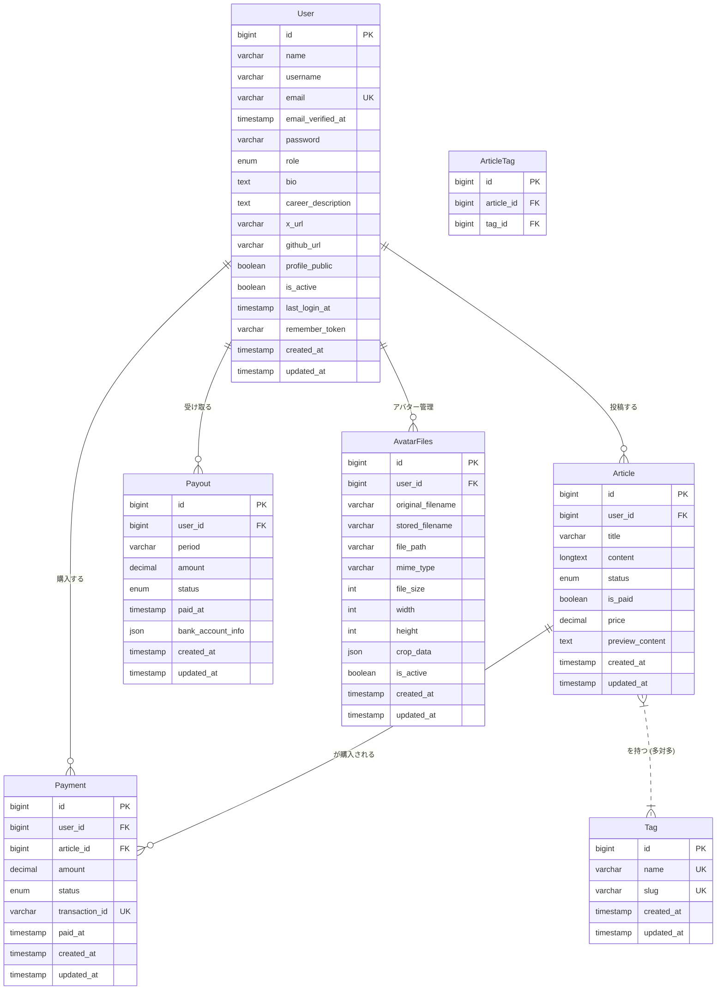
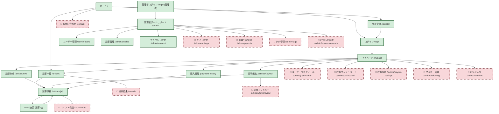
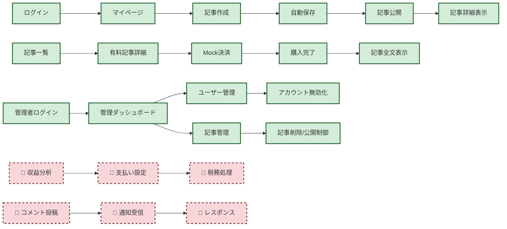

# 技術設計書

## 1. システム構成
- **フロントエンド**: Webブラウザで動作するユーザーインターフェース。
    - 技術スタック: React.js, TypeScript
    - UIフレームワーク: Tailwind CSS
    - マークダウンエディタ: `react-markdown` と `rehype-highlight` などを利用
- **バックエンド**: API提供、ビジネスロジック、データベース連携。
    - 技術スタック: PHP (Laravel Framework)
    - 認証: Laravel Sanctum (SPA認証)
- **データベース**: ユーザー情報、記事情報、決済情報などを格納。
    - 種類: MySQL
- **ファイルストレージ**: 画像、動画などのメディアファイルを保存。
    - サービス: AWS S3
- **決済システム**: 有料記事の購入処理。
    - **サービス**: **Mock実装**。MVP段階では外部の決済代行サービスは利用せず、バックエンドで決済処理を模倣する。特定のテスト用クレジットカード番号の入力に対し、成功/失敗のレスポンスを返すことで購入フローを検証する。
- **デプロイ環境**:
    - サーバー: AWS EC2
    - コンテナ化: Docker / Docker Compose (開発環境および本番環境)

## 2. データ設計

### 2.1. エンティティと属性
#### User
| 属性名           | データ型     | 制約           | 説明                               |
| :--------------- | :----------- | :------------- | :--------------------------------- |
| `id`             | BIGINT       | PK, Auto Inc.  | ユーザーID                         |
| `name`           | VARCHAR(255) | Not Null       | 表示名                             |
| `username`       | VARCHAR(255) | Not Null       | ユーザー名（一意識別子）           |
| `email`          | VARCHAR(255) | Unique, Not Null | メールアドレス                     |
| `email_verified_at` | TIMESTAMP    | Nullable       | メール認証日時                     |
| `password`       | VARCHAR(255) | Not Null       | パスワード (ハッシュ化)            |
| `role`           | ENUM('author', 'admin') | Not Null, Default: 'author' | ロール (投稿者, 管理者) |
| `bio`            | TEXT         | Nullable       | 自己紹介                           |
| `career_description` | TEXT         | Nullable       | 経歴・キャリア説明                 |
| `x_url`          | VARCHAR(255) | Nullable       | X(旧Twitter)URL                    |
| `github_url`     | VARCHAR(255) | Nullable       | GitHub URL                         |
| `profile_public` | BOOLEAN      | Default: true  | プロフィール公開設定               |
| `is_active`      | BOOLEAN      | Default: true  | アカウント有効状態                 |
| `last_login_at`  | TIMESTAMP    | Nullable       | 最終ログイン日時                   |
| `remember_token` | VARCHAR(100) | Nullable       | Remember token                     |
| `created_at`     | TIMESTAMP    | Not Null       | 登録日時                           |
| `updated_at`     | TIMESTAMP    | Not Null       | 更新日時                           |

#### AvatarFiles
| 属性名           | データ型     | 制約           | 説明                               |
| :--------------- | :----------- | :------------- | :--------------------------------- |
| `id`             | BIGINT       | PK, Auto Inc.  | アバターファイルID                 |
| `user_id`        | BIGINT       | FK (User), Cascade Delete | ユーザーID                         |
| `original_filename` | VARCHAR(255) | Not Null       | 元のファイル名                     |
| `stored_filename` | VARCHAR(255) | Not Null       | 保存時ファイル名                   |
| `file_path`      | VARCHAR(255) | Not Null       | ファイルパス                       |
| `mime_type`      | VARCHAR(255) | Not Null       | MIMEタイプ                         |
| `file_size`      | INT          | Not Null       | ファイルサイズ（バイト）           |
| `width`          | INT          | Nullable       | 画像幅                             |
| `height`         | INT          | Nullable       | 画像高さ                           |
| `crop_data`      | JSON         | Nullable       | クロッピング座標・拡大データ       |
| `is_active`      | BOOLEAN      | Default: false | アクティブ状態                     |
| `created_at`     | TIMESTAMP    | Not Null       | 作成日時                           |
| `updated_at`     | TIMESTAMP    | Not Null       | 更新日時                           |

#### Article
| 属性名           | データ型     | 制約           | 説明                               |
| :--------------- | :----------- | :------------- | :--------------------------------- |
| `id`             | BIGINT       | PK, Auto Inc.  | 記事ID                             |
| `user_id`        | BIGINT       | FK (User), Cascade Delete | 投稿ユーザーID                     |
| `title`          | VARCHAR(255) | Not Null       | 記事タイトル                       |
| `content`        | LONGTEXT     | Not Null       | 記事本文 (Markdown)                |
| `status`         | ENUM('published', 'draft') | Default: 'draft' | 公開ステータス (公開, 下書き)      |
| `is_paid`        | BOOLEAN      | Default: false | 有料/無料 (True: 有料, False: 無料) |
| `price`          | DECIMAL(10,2)| Nullable       | 価格 (有料の場合)                  |
| `preview_content` | TEXT         | Nullable       | プレビュー内容                     |
| `created_at`     | TIMESTAMP    | Not Null       | 投稿日時                           |
| `updated_at`     | TIMESTAMP    | Not Null       | 更新日時                           |

#### Tag
| 属性名       | データ型     | 制約           | 説明             |
| :----------- | :----------- | :------------- | :--------------- |
| `id`         | BIGINT       | PK, Auto Inc.  | タグID           |
| `name`       | VARCHAR(255) | Unique, Not Null | タグ名           |
| `slug`       | VARCHAR(255) | Unique, Not Null | URLスラッグ       |
| `created_at` | TIMESTAMP    | Not Null       | 作成日時         |
| `updated_at` | TIMESTAMP    | Not Null       | 更新日時         |

#### ArticleTag
| 属性名       | データ型     | 制約           | 説明             |
| :----------- | :----------- | :------------- | :--------------- |
| `id`         | BIGINT       | PK, Auto Inc.  | ID               |
| `article_id` | BIGINT       | FK (Article), Cascade Delete | 記事ID           |
| `tag_id`     | BIGINT       | FK (Tag), Cascade Delete | タグID           |
|              |              | Unique(article_id, tag_id) | 複合一意制約     |

#### Payment
| 属性名           | データ型     | 制約           | 説明                               |
| :--------------- | :----------- | :------------- | :--------------------------------- |
| `id`             | BIGINT       | PK, Auto Inc.  | 決済ID                             |
| `user_id`        | BIGINT       | FK (User), Cascade Delete | 購入者ユーザーID                   |
| `article_id`     | BIGINT       | FK (Article), Cascade Delete | 購入記事ID                         |
| `amount`         | DECIMAL(10,2)| Not Null       | 決済金額                           |
| `status`         | ENUM('success', 'failed', 'pending') | Default: 'pending' | 決済ステータス (成功, 失敗, 保留)  |
| `transaction_id` | VARCHAR(255) | Unique, Not Null | 決済トランザクションID (Mock)      |
| `paid_at`        | TIMESTAMP    | Nullable       | 決済日時                           |
| `created_at`     | TIMESTAMP    | Not Null       | 作成日時                           |
| `updated_at`     | TIMESTAMP    | Not Null       | 更新日時                           |

#### Payout
| 属性名           | データ型     | 制約           | 説明                               |
| :--------------- | :----------- | :------------- | :--------------------------------- |
| `id`             | BIGINT       | PK, Auto Inc.  | 収益分配ID                         |
| `user_id`        | BIGINT       | FK (User), Cascade Delete | 投稿ユーザーID                     |
| `period`         | VARCHAR(255) | Not Null       | 期間 (例: 2023-07)                 |
| `amount`         | DECIMAL(10,2)| Not Null       | 支払金額                           |
| `status`         | ENUM('unpaid', 'paid', 'failed') | Default: 'unpaid' | 支払ステータス (未処理, 処理済み, 失敗) |
| `paid_at`        | TIMESTAMP    | Nullable       | 支払日時                           |
| `bank_account_info` | JSON         | Nullable       | 振込先口座情報 (暗号化して保存)    |
| `created_at`     | TIMESTAMP    | Not Null       | 作成日時                           |
| `updated_at`     | TIMESTAMP    | Not Null       | 更新日時                           |

### 2.2. ER図 (Mermaid形式)

## 3. API仕様

### 3.1. 認証API
| エンドポイント | メソッド | 認証 | 説明 | リクエストパラメータ | レスポンス |
|:---|:---|:---|:---|:---|:---|
| `/api/register` | POST | 不要 | ユーザー登録 | `name`, `username`, `email`, `password`, `password_confirmation`, `role` | `{"user": {...}, "token": "..."}` |
| `/api/login` | POST | 不要 | ログイン | `email`, `password` | `{"user": {...}, "token": "..."}` |
| `/api/logout` | POST | 必要 | ログアウト | - | `{"message": "ログアウトしました"}` |
| `/api/user` | GET | 必要 | ユーザー情報取得 | - | `{"user": {...}}` |

### 3.2. 記事管理API
| エンドポイント | メソッド | 認証 | 説明 | リクエストパラメータ | レスポンス |
|:---|:---|:---|:---|:---|:---|
| `/api/articles` | GET | 不要 | 記事一覧取得 | `page`, `per_page`, `tag`, `search` | `{"data": [...], "meta": {...}}` |
| `/api/articles/{id}` | GET | 不要 | 記事詳細取得 | - | `{"data": {...}, "has_purchased": boolean}` |
| `/api/articles` | POST | 必要 | 記事作成 | `title`, `content`, `status`, `is_paid`, `price`, `tag_ids` | `{"data": {...}}` |
| `/api/articles/{id}` | PUT | 必要 | 記事更新 | `title`, `content`, `status`, `is_paid`, `price`, `tag_ids` | `{"data": {...}}` |
| `/api/articles/{id}` | DELETE | 必要 | 記事削除 | - | `{"message": "記事を削除しました"}` |
| `/api/articles/user` | GET | 必要 | 自分の記事一覧 | `page`, `per_page` | `{"data": [...], "meta": {...}}` |
| `/api/articles/{id}/tags` | POST | 必要 | 記事タグ付け | `tag_ids` | `{"data": {...}}` |
| `/api/articles/{id}/tags/{tag_id}` | DELETE | 必要 | 記事タグ削除 | - | `{"message": "タグを削除しました"}` |

### 3.3. タグ管理API
| エンドポイント | メソッド | 認証 | 説明 | リクエストパラメータ | レスポンス |
|:---|:---|:---|:---|:---|:---|
| `/api/tags` | GET | 不要 | タグ一覧取得 | - | `{"data": [...]}` |
| `/api/tags/{id}` | GET | 不要 | タグ詳細取得 | - | `{"data": {...}}` |
| `/api/tags` | POST | 必要（管理者） | タグ作成 | `name`, `slug` | `{"data": {...}}` |
| `/api/tags/{id}` | PUT | 必要（管理者） | タグ更新 | `name`, `slug` | `{"data": {...}}` |
| `/api/tags/{id}` | DELETE | 必要（管理者） | タグ削除 | - | `{"message": "タグを削除しました"}` |

### 3.4. 決済API（Mock）
| エンドポイント | メソッド | 認証 | 説明 | リクエストパラメータ | レスポンス |
|:---|:---|:---|:---|:---|:---|
| `/api/payments` | POST | 必要 | 記事購入（Mock） | `article_id`, `card_number`, `card_name`, `expiry_month`, `expiry_year`, `cvv` | `{"data": {...}}` |
| `/api/payments` | GET | 必要 | 決済履歴取得 | `page`, `per_page` | `{"data": [...], "meta": {...}}` |

### 3.5. ユーザー管理API
| エンドポイント | メソッド | 認証 | 説明 | リクエストパラメータ | レスポンス |
|:---|:---|:---|:---|:---|:---|
| `/api/user/profile` | PUT | 必要 | プロフィール更新 | `name`, `username`, `email`, `bio`, `career_description`, `x_url`, `github_url`, `profile_public` | `{"data": {...}}` |
| `/api/user/password` | PUT | 必要 | パスワード変更 | `current_password`, `new_password`, `new_password_confirmation` | `{"message": "パスワードを変更しました"}` |
| `/api/user/avatar` | POST | 必要 | アバターアップロード | `file`, `crop_data` | `{"user": {...}}` |
| `/api/user/avatar/{id}` | DELETE | 必要 | アバター削除 | - | `{"message": "アバターを削除しました"}` |
| `/api/user/activity` | GET | 必要 | アクティビティ取得 | - | `{"data": {...}}` |
| `/api/user` | DELETE | 必要 | アカウント削除 | `password` | `{"message": "アカウントを削除しました"}` |

### 3.6. 管理者API
| エンドポイント | メソッド | 認証 | 説明 | リクエストパラメータ | レスポンス |
|:---|:---|:---|:---|:---|:---|
| `/api/admin/dashboard` | GET | 必要（管理者） | ダッシュボード統計 | - | `{"statistics": {...}, "monthly_sales": [...]}` |
| `/api/admin/users` | GET | 必要（管理者） | ユーザー一覧取得 | `page`, `per_page`, `search` | `{"data": [...], "meta": {...}}` |
| `/api/admin/users/{id}` | GET | 必要（管理者） | ユーザー詳細取得 | - | `{"data": {...}}` |
| `/api/admin/users/{id}` | PUT | 必要（管理者） | ユーザー情報更新 | `is_active` | `{"data": {...}}` |
| `/api/admin/articles` | GET | 必要（管理者） | 全記事一覧取得 | `page`, `per_page`, `search`, `status` | `{"data": [...], "meta": {...}}` |
| `/api/admin/articles/{id}` | PUT | 必要（管理者） | 記事管理 | `status`, `is_featured` | `{"data": {...}}` |
| `/api/admin/articles/{id}` | DELETE | 必要（管理者） | 記事削除 | - | `{"message": "記事を削除しました"}` |

### 3.7. テストカード仕様（Mock決済）
| カード番号 | 結果 | 説明 |
|:---|:---|:---|
| `4242424242424242` | 成功 | 決済成功をシミュレート |
| `4000000000000002` | カード拒否 | カード拒否をシミュレート |
| `4000000000009995` | 残高不足 | 残高不足をシミュレート |

## 4. UI/UX設計
- **ダークモード**: OSの設定やユーザーの選択に応じて、ライト/ダークのテーマを切り替え。
- **マークダウンエディタ**: シンタックスハイライト、リアルタイムプレビュー、コピーボタンを備えたエディタを提供。
- PCのみ対応。
- 直感的な操作性。

## 5. セキュリティ設計
- **認証**: Laravel Sanctum によるセッション管理。
- **認可**: ロールベースアクセス制御 (RBAC)。運営者と投稿ユーザーでアクセス可能なAPIを制御。
- **パスワード**: ハッシュ化して保存。
- **入力値検証**: 全てのユーザー入力に対して厳格な検証。
- **HTTPS**: 全ての通信を暗号化。
- **決済情報**: Mock実装のため、本番の決済情報は扱わない。ただし、将来的な本番決済システム導入を想定した設計とする。
- **脆弱性対策**: OWASP Top 10を考慮した設計・実装。

## 6. 機能一覧
| 優先度 | 登場人物     | 機能カテゴリ       | 機能名             | 説明                                   |
| :----- | :----------- | :----------------- | :----------------- | :------------------------------------- |
| MVP    | 共通         | UI                 | ダークモード対応   | ライト/ダークテーマの切替機能          |
| MVP    | 共通         | 記事閲覧           | 記事検索           | キーワード、タグによる記事の検索機能   |
| MVP    | 共通         | 記事閲覧           | 無料記事閲覧       | 無料記事の閲覧                         |
| MVP    | 共通         | 記事閲覧           | 有料記事購入・閲覧 (Mock) | 有料記事の購入・閲覧（Mock決済）       |
| MVP    | サイト運営者 | 収益管理           | 収益管理ダッシュボード | サイト全体の収益状況の確認             |
| MVP    | サイト運営者 | 記事管理           | 記事管理           | 全記事の一覧表示、内容確認、削除       |
| MVP    | サイト運営者 | ユーザー管理       | ユーザー管理       | 投稿ユーザーの一覧表示、アカウント停止 |
| MVP    | 投稿ユーザー | 記事管理           | 記事投稿・編集     | 高機能マークダウンエディタによる記事作成、公開・非公開、有料・無料、タグ設定 |
| MVP    | 投稿ユーザー | 記事管理           | 自身の記事閲覧     | 投稿した記事の一覧表示と詳細閲覧       |
| MVP    | 投稿ユーザー | ユーザー認証       | ユーザー登録・ログイン | メールアドレスとパスワードによる登録・ログイン |
| 高     | 共通         | お問い合わせ       | お問い合わせ機能   | サイト運営者へのお問い合わせフォーム   |
| 高     | 共通         | コメント           | コメント機能       | 記事へのコメント投稿、閲覧             |
| 高     | サイト運営者 | サイト設定         | サイト設定         | サイト名、ロゴ、利用規約、プライバシーポリシーなどの設定 |
| 高     | サイト運営者 | 収益管理           | 投稿ユーザーへの収益分配管理 | 投稿ユーザーへの収益分配処理を行う     |
| 高     | サイト運営者 | ダッシュボード     | 重要指標可視化     | ユーザー数、記事投稿数などをグラフで表示 |
| 高     | 投稿ユーザー | ダッシュボード     | 自身の収益状況の確認 | 自身の収益状況の確認                   |
| 高     | 投稿ユーザー | プロフィール管理   | プロフィール管理   | プロフィール情報（ユーザー名、自己紹介など）の編集 |
| 高     | 投稿ユーザー | 収益管理           | 収益受け取り設定   | 収益の振込先口座情報の設定             |
| 中     | サイト運営者 | お知らせ           | お知らせ・アナウンス機能 | サイト全体へのお知らせ配信             |
| 中     | サイト運営者 | コンテンツ管理     | 特集記事設定機能   | 特定の記事をトップページなどで目立たせる機能 |
| 中     | サイト運営者 | タグ管理           | タグ管理           | タグの追加・編集・削除                 |
| 中     | 投稿ユーザー | 記事管理           | 記事プレビュー機能 | 記事の公開前に内容を確認する機能       |

## 7. 画面一覧

### 7.1. 全画面一覧（実装状況統合）

| 登場人物 | 画面名 | URL | 実装状況 | 認証 | 機能概要 |
| :------- | :----- | :-- | :------: | :--: | :------- |
| **基本画面** |
| 共通 | ホーム画面 | `/` | ✅ | 不要 | サイト概要、新着記事表示 |
| 共通 | ログイン画面 | `/login` | ✅ | 不要 | ユーザー認証 |
| 共通 | 会員登録画面 | `/register` | ✅ | 不要 | 新規ユーザー登録 |
| 共通 | 記事一覧画面 | `/articles` | ✅ | 不要 | 全記事表示・検索 |
| 共通 | 記事詳細画面 | `/articles/{id}` | ✅ | 不要 | 記事内容表示・決済 |
| 共通 | お問い合わせ画面 | `/contact` | 🚧 | 不要 | サポート・問い合わせフォーム |
| 共通 | 検索結果画面 | `/search` | 🚧 | 不要 | キーワード・タグ検索結果 |
| **記事管理画面** |
| 投稿ユーザー | 記事作成画面 | `/articles/new` | ✅ | 必要 | マークダウンエディタ |
| 投稿ユーザー | 記事編集画面 | `/articles/{id}/edit` | ✅ | 必要 | 記事内容編集 |
| 投稿ユーザー | 記事プレビュー画面 | `/articles/{id}/preview` | 🚧 | 必要 | 公開前プレビュー |
| **ユーザー画面** |
| 投稿ユーザー | マイページ | `/mypage` | ✅ | 必要 | プロフィール・記事管理 |
| 投稿ユーザー | 購入履歴画面 | `/payment-history` | ✅ | 必要 | 決済履歴表示 |
| 投稿ユーザー | ダッシュボード画面 | `/dashboard` | ✅ | 必要 | 認証確認用画面 |
| 共通 | ユーザープロフィール画面 | `/users/{username}` | 🚧 | 不要 | 他ユーザープロフィール表示 |
| **作者機能画面** |
| 投稿ユーザー | 収益ダッシュボード | `/author/dashboard` | 🚧 | 必要 | 作者の売上・分析情報 |
| 投稿ユーザー | 収益設定画面 | `/author/payout-settings` | 🚧 | 必要 | 支払い先・税務設定 |
| 投稿ユーザー | フォロー管理画面 | `/author/following` | 🚧 | 必要 | フォロー・フォロワー管理 |
| 投稿ユーザー | お気に入り管理画面 | `/author/favorites` | 🚧 | 必要 | お気に入り記事管理 |
| **管理者画面** |
| 管理者 | 管理者ダッシュボード | `/admin` | ✅ | 管理者 | 統計・概要情報 |
| 管理者 | ユーザー管理画面 | `/admin/users` | ✅ | 管理者 | ユーザー一覧・制御 |
| 管理者 | 記事管理画面 | `/admin/articles` | ✅ | 管理者 | 記事一覧・制御 |
| 管理者 | 管理者アカウント画面 | `/admin/account` | ✅ | 管理者 | 管理者設定 |
| 管理者 | サイト設定画面 | `/admin/settings` | 🚧 | 管理者 | 全体設定・メンテナンス |
| 管理者 | 収益分配管理画面 | `/admin/payouts` | 🚧 | 管理者 | 作者への支払い管理 |
| 管理者 | タグ管理画面 | `/admin/tags` | 🚧 | 管理者 | タグ作成・編集・削除 |
| 管理者 | お知らせ管理画面 | `/admin/announcements` | 🚧 | 管理者 | サイトお知らせ管理 |
| **機能拡張** |
| 共通 | コメント機能 | `/articles/{id}#comments` | 🚧 | 必要 | 記事へのコメント投稿・表示 |

**実装状況**: ✅完了 14画面 / 🚧未実装 12画面 （合計26画面）

### 7.2. 特殊機能実装状況

| 機能名 | 実装状況 | 説明 |
| :----- | :------: | :--- |
| **ダークモード切り替え** | ✅ | 全画面でライト/ダーク対応 |
| **レスポンシブデザイン** | ✅ | モバイル・タブレット・PC対応 |
| **認証・認可制御** | ✅ | ログイン状態・権限ベースアクセス制御 |
| **Mock決済フロー** | ✅ | 有料記事購入・決済履歴管理 |
| **アバター管理** | ✅ | 画像アップロード・クロッピング機能 |
| **アクティビティヒートマップ** | ✅ | GitHub風記事投稿活動表示 |
| **自動保存機能** | ✅ | 記事エディタでの下書き自動保存 |
| **Badge UI統一** | ✅ | 記事ステータス・価格・決済状況の統一表示 |

## 8. 画面遷移図

### 8.1. 全体画面遷移図（実装状況統合）

### 8.2. 主要機能の画面遷移フロー（実装状況統合）

## 9. その他
- **開発言語**: フロントエンド: JavaScript/TypeScript, バックエンド: PHP
- **バージョン管理**: Git
- **CI/CD**: GitHub Actions / GitLab CI (検討)
- **テスト**: ユニットテスト、結合テスト、E2Eテスト。
- **開発環境**: Docker / Docker Compose を使用し、各サービスをコンテナ化。
- **本番環境**: AWS EC2 上で Docker コンテナをデプロイ.

## 10. 開発環境のバージョン
- **Node.js**: 20.x (LTS)
- **npm**: 10.x (Node.js 20.xに同梱)
- **React**: 18.x
- **TypeScript**: 5.x
- **Tailwind CSS**: 3.x
- **PHP**: 8.3.x
- **Laravel**: 11.x
- **MySQL**: 8.0.x
- **Docker / Docker Compose**: 最新の安定版