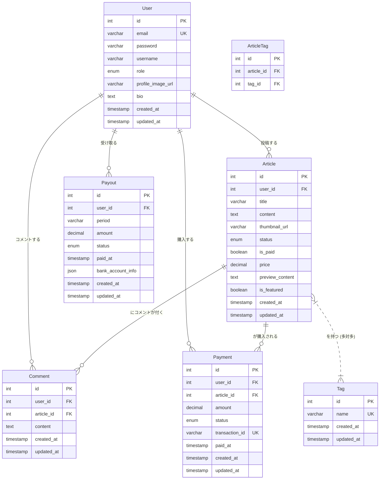

# 技術設計書

## 1. システム構成
- **フロントエンド**: Webブラウザで動作するユーザーインターフェース。
    - 技術スタック: React.js, TypeScript
    - UIフレームワーク: Tailwind CSS
    - マークダウンエディタ: `react-markdown` と `rehype-highlight` などを利用
- **バックエンド**: API提供、ビジネスロジック、データベース連携。
    - 技術スタック: PHP (Laravel Framework)
    - 認証: Laravel Sanctum (SPA認証)
- **データベース**: ユーザー情報、記事情報、決済情報などを格納。
    - 種類: MySQL
- **ファイルストレージ**: 画像、動画などのメディアファイルを保存。
    - サービス: AWS S3
- **決済システム**: 有料記事の購入処理。
    - **サービス**: **Mock実装**。MVP段階では外部の決済代行サービスは利用せず、バックエンドで決済処理を模倣する。特定のテスト用クレジットカード番号の入力に対し、成功/失敗のレスポンスを返すことで購入フローを検証する。
- **デプロイ環境**:
    - サーバー: AWS EC2
    - コンテナ化: Docker / Docker Compose (開発環境および本番環境)

## 2. データ設計

### 2.1. エンティティと属性
#### User
| 属性名           | データ型     | 制約           | 説明                               |
| :--------------- | :----------- | :------------- | :--------------------------------- |
| `id`             | INT          | PK, Auto Inc.  | ユーザーID                         |
| `email`          | VARCHAR(255) | Unique         | メールアドレス                     |
| `password`       | VARCHAR(255) | Not Null       | パスワード (ハッシュ化)            |
| `username`       | VARCHAR(255) | Not Null       | ユーザー名                         |
| `role`           | ENUM         | Not Null       | ロール (投稿ユーザー, サイト運営者) |
| `profile_image_url` | VARCHAR(255) | Nullable       | プロフィール画像URL                |
| `bio`            | TEXT         | Nullable       | 自己紹介                           |
| `created_at`     | TIMESTAMP    | Not Null       | 登録日時                           |
| `updated_at`     | TIMESTAMP    | Not Null       | 更新日時                           |

#### Article
| 属性名           | データ型     | 制約           | 説明                               |
| :--------------- | :----------- | :------------- | :--------------------------------- |
| `id`             | INT          | PK, Auto Inc.  | 記事ID                             |
| `user_id`        | INT          | FK (User)      | 投稿ユーザーID                     |
| `title`          | VARCHAR(255) | Not Null       | 記事タイトル                       |
| `content`        | TEXT         | Not Null       | 記事本文 (Markdown)                |
| `thumbnail_url`  | VARCHAR(255) | Nullable       | サムネイル画像URL                  |
| `status`         | ENUM         | Not Null       | 公開ステータス (公開, 非公開)      |
| `is_paid`        | BOOLEAN      | Not Null       | 有料/無料 (True: 有料, False: 無料) |
| `price`          | DECIMAL(10,2)| Nullable       | 価格 (有料の場合)                  |
| `preview_content`| TEXT         | Nullable       | プレビュー用コンテンツ             |
| `is_featured`    | BOOLEAN      | Not Null, Default: False | 特集記事フラグ (True: 特集)        |
| `created_at`     | TIMESTAMP    | Not Null       | 投稿日時                           |
| `updated_at`     | TIMESTAMP    | Not Null       | 更新日時                           |

#### Tag
| 属性名       | データ型     | 制約           | 説明             |
| :----------- | :----------- | :------------- | :--------------- |
| `id`         | INT          | PK, Auto Inc.  | タグID           |
| `name`       | VARCHAR(255) | Unique, Not Null | タグ名           |
| `created_at` | TIMESTAMP    | Not Null       | 作成日時         |
| `updated_at` | TIMESTAMP    | Not Null       | 更新日時         |

#### ArticleTag
| 属性名       | データ型     | 制約           | 説明             |
| :----------- | :----------- | :------------- | :--------------- |
| `id`         | INT          | PK, Auto Inc.  | ID               |
| `article_id` | INT          | FK (Article)   | 記事ID           |
| `tag_id`     | INT          | FK (Tag)       | タグID           |

#### Payment
| 属性名           | データ型     | 制約           | 説明                               |
| :--------------- | :----------- | :------------- | :--------------------------------- |
| `id`             | INT          | PK, Auto Inc.  | 決済ID                             |
| `user_id`        | INT          | FK (User)      | 購入者ユーザーID                   |
| `article_id`     | INT          | FK (Article)   | 購入記事ID                         |
| `amount`         | DECIMAL(10,2)| Not Null       | 決済金額                           |
| `status`         | ENUM         | Not Null       | 決済ステータス (成功, 失敗, 保留)  |
| `transaction_id` | VARCHAR(255) | Unique, Not Null | 決済トランザクションID (Mock)      |
| `paid_at`        | TIMESTAMP    | Not Null       | 決済日時                           |
| `created_at`     | TIMESTAMP    | Not Null       | 作成日時                           |
| `updated_at`     | TIMESTAMP    | Not Null       | 更新日時                           |

#### Comment
| 属性名       | データ型     | 制約           | 説明             |
| :----------- | :----------- | :------------- | :--------------- |
| `id`         | INT          | PK, Auto Inc.  | コメントID       |
| `user_id`    | INT          | FK (User)      | コメント投稿者ID |
| `article_id` | INT          | FK (Article)   | 記事ID           |
| `content`    | TEXT         | Not Null       | コメント内容     |
| `created_at` | TIMESTAMP    | Not Null       | 投稿日時         |
| `updated_at` | TIMESTAMP    | Not Null       | 更新日時         |

#### Payout
| 属性名           | データ型     | 制約           | 説明                               |
| :--------------- | :----------- | :------------- | :--------------------------------- |
| `id`             | INT          | PK, Auto Inc.  | 収益分配ID                         |
| `user_id`        | INT          | FK (User)      | 投稿ユーザーID                     |
| `period`         | VARCHAR(255) | Not Null       | 期間 (例: 2023-07)                 |
| `amount`         | DECIMAL(10,2)| Not Null       | 支払金額                           |
| `status`         | ENUM         | Not Null       | 支払ステータス (未処理, 処理済み, 失敗) |
| `paid_at`        | TIMESTAMP    | Nullable       | 支払日時                           |
| `bank_account_info` | JSON         | Nullable       | 振込先口座情報 (暗号化して保存)    |
| `created_at`     | TIMESTAMP    | Not Null       | 作成日時                           |
| `updated_at`     | TIMESTAMP    | Not Null       | 更新日時                           |

### 2.2. ER図 (Mermaid形式)

## 3. インターフェース設計

### 3.1. RESTful API一覧
| 機能カテゴリ   | 機能名             | HTTPメソッド | エンドポイント                 | 説明                                   |
| :------------- | :----------------- | :----------- | :----------------------------- | :------------------------------------- |
| ユーザー認証   | ユーザー登録       | POST         | `/api/auth/register`           | 新規ユーザーを登録する                 |
|                | ログイン           | POST         | `/api/auth/login`              | ユーザー認証を行い、トークンを発行する |
| 運営管理       | [運営]ユーザー一覧取得 | GET          | `/api/admin/users`             | 全ユーザーの一覧を取得する             |
|                | [運営]ユーザー情報更新 | PUT          | `/api/admin/users/{id}`        | 特定ユーザーの情報を更新する           |
|                | [運営]ユーザーアカウント停止 | DELETE       | `/api/admin/users/{id}`        | 特定ユーザーのアカウントを停止する     |
|                | [運営]記事一覧取得   | GET          | `/api/admin/articles`          | 全記事の一覧を取得する                 |
|                | [運営]記事更新     | PUT          | `/api/admin/articles/{id}`     | 特定記事を更新（特集設定など）         |
|                | [運営]記事削除     | DELETE       | `/api/admin/articles/{id}`     | 特定記事を削除する                     |
|                | [運営]タグ一覧取得   | GET          | `/api/admin/tags`              | 全タグの一覧を取得する                 |
|                | [運営]タグ作成     | POST         | `/api/admin/tags`              | 新規タグを作成する                     |
|                | [運営]タグ更新     | PUT          | `/api/admin/tags/{id}`         | 特定タグを更新する                     |
|                | [運営]タグ削除     | DELETE       | `/api/admin/tags/{id}`         | 特定タグを削除する                     |
|                | [運営]収益ダッシュボード取得 | GET        | `/api/admin/dashboard/sales`   | 売上などの重要指標を取得する           |
| 記事管理       | 記事作成           | POST         | `/api/articles`                | 新規記事を作成する (タグ情報を含む)    |
|                | 記事一覧取得       | GET          | `/api/articles`                | 全記事の一覧を取得する (タグ絞り込み可) |
|                | 記事詳細取得       | GET          | `/api/articles/{id}`           | 特定記事の詳細を取得する               |
|                | 記事更新           | PUT          | `/api/articles/{id}`           | 特定記事を更新する (タグ情報を含む)    |
|                | 記事削除           | DELETE       | `/api/articles/{id}`           | 特定記事を削除する                     |
| 決済 (Mock)    | 記事購入 (Mock)    | POST         | `/api/payments`                | 有料記事の購入処理を行う (Mock)        |
|                | 決済履歴取得       | GET          | `/api/payments`                | 自身の決済履歴を取得する               |
| コメント       | コメント投稿       | POST         | `/api/articles/{id}/comments`  | 特定記事にコメントを投稿する           |
|                | コメント一覧取得   | GET          | `/api/articles/{id}/comments`  | 特定記事のコメント一覧を取得する       |

### 3.2. UI/UX設計
- **ダークモード**: OSの設定やユーザーの選択に応じて、ライト/ダークのテーマを切り替え。
- **マークダウンエディタ**: シンタックスハイライト、リアルタイムプレビュー、コピーボタンを備えたエディタを提供。
- PCのみ対応。
- 直感的な操作性。

## 4. セキュリティ設計
- **認証**: Laravel Sanctum によるセッション管理。
- **認可**: ロールベースアクセス制御 (RBAC)。運営者と投稿ユーザーでアクセス可能なAPIを制御。
- **パスワード**: ハッシュ化して保存。
- **入力値検証**: 全てのユーザー入力に対して厳格な検証。
- **HTTPS**: 全ての通信を暗号化。
- **決済情報**: Mock実装のため、本番の決済情報は扱わない。ただし、将来的な本番決済システム導入を想定した設計とする。
- **脆弱性対策**: OWASP Top 10を考慮した設計・実装。

## 5. 機能一覧
| 優先度 | 登場人物     | 機能カテゴリ       | 機能名             | 説明                                   |
| :----- | :----------- | :----------------- | :----------------- | :------------------------------------- |
| MVP    | 共通         | UI                 | ダークモード対応   | ライト/ダークテーマの切替機能          |
| MVP    | 共通         | 記事閲覧           | 記事検索           | キーワード、タグによる記事の検索機能   |
| MVP    | 共通         | 記事閲覧           | 無料記事閲覧       | 無料記事の閲覧                         |
| MVP    | 共通         | 記事閲覧           | 有料記事購入・閲覧 (Mock) | 有料記事の購入・閲覧（Mock決済）       |
| MVP    | サイト運営者 | 収益管理           | 収益管理ダッシュボード | サイト全体の収益状況の確認             |
| MVP    | サイト運営者 | 記事管理           | 記事管理           | 全記事の一覧表示、内容確認、削除       |
| MVP    | サイト運営者 | ユーザー管理       | ユーザー管理       | 投稿ユーザーの一覧表示、アカウント停止 |
| MVP    | 投稿ユーザー | 記事管理           | 記事投稿・編集     | 高機能マークダウンエディタによる記事作成、公開・非公開、有料・無料、タグ設定 |
| MVP    | 投稿ユーザー | 記事管理           | 自身の記事閲覧     | 投稿した記事の一覧表示と詳細閲覧       |
| MVP    | 投稿ユーザー | ユーザー認証       | ユーザー登録・ログイン | メールアドレスとパスワードによる登録・ログイン |
| 高     | 共通         | お問い合わせ       | お問い合わせ機能   | サイト運営者へのお問い合わせフォーム   |
| 高     | 共通         | コメント           | コメント機能       | 記事へのコメント投稿、閲覧             |
| 高     | サイト運営者 | サイト設定         | サイト設定         | サイト名、ロゴ、利用規約、プライバシーポリシーなどの設定 |
| 高     | サイト運営者 | 収益管理           | 投稿ユーザーへの収益分配管理 | 投稿ユーザーへの収益分配処理を行う     |
| 高     | サイト運営者 | ダッシュボード     | 重要指標可視化     | ユーザー数、記事投稿数などをグラフで表示 |
| 高     | 投稿ユーザー | ダッシュボード     | 自身の収益状況の確認 | 自身の収益状況の確認                   |
| 高     | 投稿ユーザー | プロフィール管理   | プロフィール管理   | プロフィール情報（ユーザー名、自己紹介など）の編集 |
| 高     | 投稿ユーザー | 収益管理           | 収益受け取り設定   | 収益の振込先口座情報の設定             |
| 中     | サイト運営者 | お知らせ           | お知らせ・アナウンス機能 | サイト全体へのお知らせ配信             |
| 中     | サイト運営者 | コンテンツ管理     | 特集記事設定機能   | 特定の記事をトップページなどで目立たせる機能 |
| 中     | サイト運営者 | タグ管理           | タグ管理           | タグの追加・編集・削除                 |
| 中     | 投稿ユーザー | 記事管理           | 記事プレビュー機能 | 記事の公開前に内容を確認する機能       |

## 6. 画面一覧
| 優先度 | 登場人物     | 画面名             | URL                            | 説明                                   |
| :----- | :----------- | :----------------- | :----------------------------- | :------------------------------------- |
| MVP    | 共通         | 記事購入画面 (Mock) | `/articles/{id}/purchase`      | 有料記事の購入手続きを行う画面 (Mock)  |
| MVP    | 共通         | 記事詳細画面       | `/articles/{id}`               | 記事の詳細内容、コードブロック、タグを表示 |
| MVP    | 共通         | トップページ (記事一覧) | `/`                            | 特集記事、新着記事一覧、タグ検索機能   |
| MVP    | サイト運営者 | [運営] 記事管理一覧画面 | `/admin/articles`              | 全記事の一覧。特集設定の切り替えも可能 |
| MVP    | サイト運営者 | [運営] ログイン画面 | `/admin/login`                 | サイト運営者がログインする画面         |
| MVP    | サイト運営者 | [運営] 収益管理ダッシュボード画面 | `/admin/dashboard`             | サイト全体の収益状況を表示する画面     |
| MVP    | サイト運営者 | [運営] ユーザー管理一覧画面 | `/admin/users`                 | 登録ユーザーの一覧を表示し、管理する画面 |
| MVP    | 投稿ユーザー | ログイン画面       | `/login`                       | 登録済みユーザーがログインする画面     |
| MVP    | 投稿ユーザー | 記事投稿・編集画面 | `/user/articles/new` / `/user/articles/{id}/edit` | 高機能マークダウンエディタ、タグ入力欄 |
| MVP    | 投稿ユーザー | 自身の記事一覧画面 | `/user/articles`               | 投稿した記事の一覧を表示する画面       |
| MVP    | 投稿ユーザー | ユーザー登録画面   | `/register`                    | 新規ユーザー登録を行う画面             |
| 高     | 共通         | お問い合わせフォーム画面 | `/contact`                     | サイト運営者へのお問い合わせを送信する画面 |
| 高     | サイト運営者 | [運営] サイト設定画面 | `/admin/settings`              | サイトの基本設定を行う画面             |
| 高     | サイト運営者 | [運営] 収益分配管理画面 | `/admin/payouts`               | 投稿ユーザーへの収益分配を管理する画面 |
| 高     | 投稿ユーザー | プロフィール編集画面 | `/user/profile/edit`           | プロフィール情報を編集する画面         |
| 高     | 投稿ユーザー | 投稿ユーザーダッシュボード画面 | `/user/dashboard`              | 自身の記事一覧、収益状況などを表示する画面 |
| 高     | 投稿ユーザー | 収益受け取り設定画面 | `/user/payout-settings`        | 収益の振込先口座情報を設定する画面     |
| 中     | サイト運営者 | [運営] お知らせ管理画面 | `/admin/announcements`         | お知らせの作成・管理を行う画面         |
| 中     | サイト運営者 | [運営] タグ管理画面 | `/admin/tags`                  | タグの追加・編集・削除を行う画面       |
| 中     | 投稿ユーザー | 記事プレビュー画面 | `/user/articles/{id}/preview`  | 記事の公開前に内容を確認する画面       |

## 7. 画面遷移図

## 8. その他
- **開発言語**: フロントエンド: JavaScript/TypeScript, バックエンド: PHP
- **バージョン管理**: Git
- **CI/CD**: GitHub Actions / GitLab CI (検討)
- **テスト**: ユニットテスト、結合テスト、E2Eテスト。
- **開発環境**: Docker / Docker Compose を使用し、各サービスをコンテナ化。
- **本番環境**: AWS EC2 上で Docker コンテナをデプロイ.

## 9. 開発環境のバージョン
- **Node.js**: 20.x (LTS)
- **npm**: 10.x (Node.js 20.xに同梱)
- **React**: 18.x
- **TypeScript**: 5.x
- **Tailwind CSS**: 3.x
- **PHP**: 8.3.x
- **Laravel**: 11.x
- **MySQL**: 8.0.x
- **Docker / Docker Compose**: 最新の安定版
